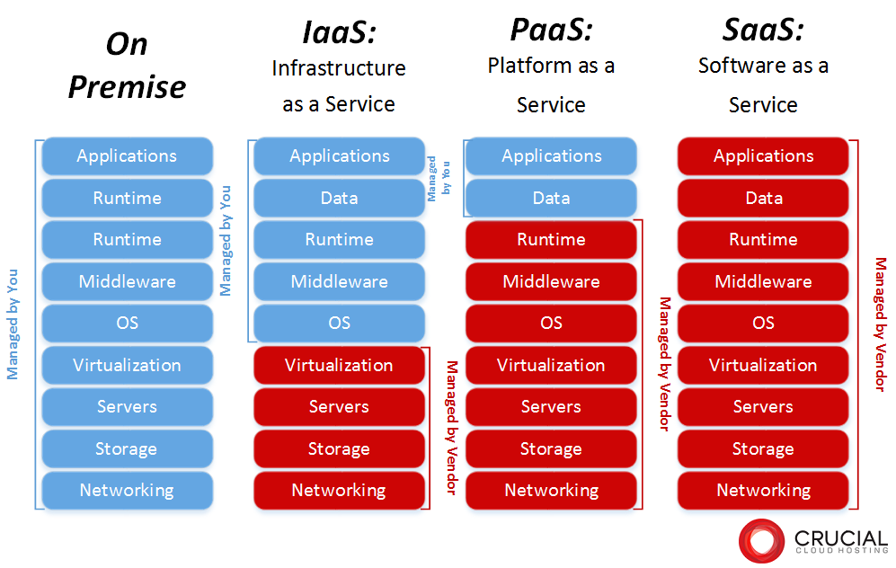

# Cloud Computing 과 AWS

## Cloud Computing?

1. Cloud Computing ​은 인터넷\(“클라우드”\)을 통해 서버, 스토리지, 데이터베이스, 네트워킹,  소프트웨어, 분석, 인텔리전스 등의 컴퓨팅 서비스를 제공하는 것 이다.   즉, 일반적으로 인터넷 종량제 방식이며 **온디맨드\(on-demand\)**  _컴퓨팅 서비스를  제공하는 것.  📍_ On-Demand?   고객의요구가 있을 때 언제 어디서나 고객 중심에서 니즈를 해결해 주는 것.    한마디로 온디맨드는 공급이 아니라 수요가 모든 것을 결정하는 시스템 →  기업의 운명과  비즈니스의 성패가 전적으로 고객의 손끝에서 움직이는 모바일에 달린 시대가 도래 한 것.  
2. 인터넷 상의 서버에 단순히 자료를 저장하는 것 뿐만 아니라, 클라이언트 프로그램을  설치하지 않아도 웹에서 제공하는 응용 프로그램을 이용하여 원하는 작업을 ​개인 또는  여러 사람이 동시에 공유하면서 진행​할 수도 있다.   
3. 클라우드 컴퓨팅을 사용하면 하드웨어에 막대한 사전 투자를 하거나 하드웨어를 유지 관리하기 위해 많은 시간을 할애하지 않아도 된다.

## Cloud Computing Service?

1. **SaaS\(Software as Service\)**  : 서비스로서의 소프트웨어  인터넷을 통한 주문형과 일반적인 구독 방식으로 소프트웨어 애플리케이션을 제공하는  방법이다. 즉, 이용자가 원하는 소프트웨어를 임대ㆍ제공하는 서비스이다.    ex\) Google G suite\(Google docs\), Office365, Naver Cloud  
2. **PaaS\(Platform as a Service\) :** 서비스로서의 플랫폼  이용자에게 소프트웨어 개발에 필요한 플랫폼을 임대ㆍ제공하는 서비스이다. 스토리지 및  기타 컴퓨팅 리소스 외에도 사용자는 사전 구축 된 도구 모음을 사용하여 자체 응용  프로그램을 개발, 사용자 지정 및 테스트 할 수 있다.    PaaS를 이용한다면 서비스 외적인 부분에 시간과 비용을 들이지 않고 서비스 개발에 집중할 수 있으므로 기존 물리환경에서 서비스를 개발할 때보다 비교적 적은 비용으로 신속하고 간편하게 서비스를 개발하고 운영할 수 있다. ex\) OS, JDK, DB, WAS  
3. **IaaS\(Infrastructure as a Service\)**  : 서비스로서의 IT인프라   공급업체가 사용자에게 서버, 스토리지 및 네트워킹과 같은 컴퓨팅 리소스에 대한  액세스를 제공하는 클라우드 컴퓨팅 제품이다. 조직은 서비스 제공 업체 인프라 내에서  자체 플랫폼과 응용 프로그램을 사용할 수 있다.   즉, 이용자에게 서버, 스토리지 등의 하드웨어 자원만을 임대ㆍ제공하는 서비스이다.   ex\) AWS, MS azure, Google GCP  

## Cloud Computing 유형?

1. **Public Cloud** - 인터넷을 통해 일반 사용자에게 리소를 공유하고 서비스를 제공.  공용 클라우드를 사용할 경우 모든 하드웨어, 소프트웨어 및 기타 지원 인프라를 클라우드 공급자가 소유하고 관리한다. 공용 클라우드에서 다른 조직 또는 클라우드  “테넌트”와 동일한 하드웨어, 스토리지 및 네트워크 디바이스를 공유한다.  웹 브라우저를 사용하여 서비스에 액세스하고 계정을 관리. 공용 클라우드 배포는 웹 기반 메일, 온라인 사무실 애플리케이션, 스토리지 및 테스트 및 개발 환경을 제공하는 데 자주 사용. -&gt; 비용 절감, 유지 관리 안해도 됨, 무제한에 가까운 확장성\(주문형 리소스 사용\), 높은 안정성\(광대한 서버 네트워크를 통한 실패 방지\)  
2. **Private Cloud** - 공유하지 않고, 일반적으로 개인 내부 네트워크를 통해 서비스를  제공.  서비스와 인프라가 항상 프라이빗 네트워크에서 유지 관리되며, 하드웨어와 소프트웨어는 조직에서만 전용으로 사용한다. 따라서 프라이빗 클라우드를 통해 조직이 특정 IT 요구 사항을 만족시키도록 리소스를 쉽게 사용자 지정할 수 있다. 유연성 향상, 높은 확장성  
3.  **Hybrid Cloud** - 해당 목적에 따라 퍼블릭 클라우드와 프라이빗 클라우드 간에  서비스를 공유.   프라이빗 클라우드와 퍼블릭 클라우드 간에 데이터와 애플리케이션이 이동할 수 있으므로 유연성을 향상시 키고 더 많은 배포 옵션을 제공합니다. 예를 들어 웹 기반 메일과 같이 볼륨은 많고 보안요구 사항은 낮은 경우에는 퍼블릭 클라우드를 사용하고, 재무 보고와 같이 민감하고 비즈니스에 중요한 작업에는 프라이빗 클라우드\(또는 다른 온-프레미스 인프라\)를 사용 
4. **Community Cloud** - 정부 기관 같은 조직에서만 리소스를 공유.  공통 관심사\(보안, 법 준수, 관할 권 등\)를 가진 특정 커뮤 니티의 여러 조직들 간에 인프라스트럭처를 공유하며, 내부적으로 또는 서드파티에 의해 관리되거나 내외부적으로 호스팅 된다. 공개형 클라우드 보다 더 적은 \(그러나 폐쇄 형 클라우드 보다는 더 많은\) 수의 사용자들에게 비용이 전가되므로 클라우드 컴퓨팅에 잠재 적인 비용 절감 중 일부분만 실현한다.

## AWS\(Amazon Web Services\)

* Cloud Computing 방식\(on-demand\)의 시초이다. Amazon Web Services 는 아마존\(Amazon\)에서 제공하는 클라우드 서비스로, 네트워킹을 기반으로 가상 컴퓨터와 스토리지, 네트워크 인프라 등 다양한 서비스를 제공하고 있다. 현재 소규모 법인\(회사\) 및 개인 을 포함한 다양한 사용자들이 사용하고 있으며, 클라우드 컴퓨팅의 장점을 이용하기 위해 많은 거대 기업에서도 활용하고 있다.\(B2B 형태\) 
* AWS의 종류

  *  **EC2\(Elastic Computer Cloud\)**​ ​- ​가장 일반적으로 사용되는 서비스이며 독립적인 서비스이다.\(AWS에서 가장 중요한 서비스\) Linux, Window 등을 제공하고 웹서버, 애플리케이션, 데이터베이스, 파일서버 등 기본적인 것을 제공한다. 즉, 클릭 몇 번 만으로 컴퓨터 1대를 설치할 수 있으므로 편리하고, 유연하고 탄력있는 컴퓨팅이 가능하다. \(생성 및 삭제 쉬움\)  
  *  **S3\(Simple Storage Service\)** ​- ​파일 서버. 이미지, 동영상, 파일 등 제공 무제한 저장\(?\), 1byte ~ 5TB 단일 파일 저장 가능  
  *  **RDS\(Relational Database Service\)** ​-​ ​데이터베이스 서버. Mysql, SQL Server, Oracle 등을 제공. 백업 / 리플레케이션단 아마존이 자동 제공.

  
  

🔗 참조 site 

* [https://wnsgml972.github.io/network/network\_cloud-computing.html](https://wnsgml972.github.io/network/network_cloud-computing.html) 
*  ​[https://www.techradar.com/news/best-cloud-computing-service](https://www.techradar.com/news/best-cloud-computing-service) 
*  ​[https://wnsgml972.github.io/network/network\_cloud-computing.html](https://wnsgml972.github.io/network/network_cloud-computing.html) 
*  ​[https://www.ibm.com/cloud/learn/iaas-paas-saas](https://www.ibm.com/cloud/learn/iaas-paas-saas) 
*  ​[https://azure.microsoft.com/ko-kr/overview/cloud-computing-dictionary/](https://azure.microsoft.com/ko-kr/overview/cloud-computing-dictionary/) 
*  ​[https://codingmania.tistory.com/15](https://codingmania.tistory.com/15) 
*  ​[https://aws.amazon.com/ko/what-is-aws/](https://aws.amazon.com/ko/what-is-aws/)

